# 00 — Kyro Onboarding: Start Here

> **Purpose:** get **Aniket and Gowrish** (and anyone new) from *zero* to *fully understanding our product and how it's built* — assuming **no background** in machine learning, cloud, neuroscience, or clinical medicine. These four docs are written to be read in order, but each stands alone.
>
> *(This is the gentle, narrative onboarding layer. The numbered `docs/01`–`docs/21` are the dense working docs — the case, evidence base, full architecture, the node-by-node clinical tree, the mentor pack, etc. Pointers at the bottom.)*

---

## Read in this order

| # | File | What you'll understand | Best for |
|---|---|---|---|
| **1** | [`01-product.md`](01-product.md) | What Kyro *is*, the patient & problem, the 5 features, a full user journey, the business | **everyone** (esp. the product/pitch story) |
| **2** | [`02-ml-explained.md`](02-ml-explained.md) | Crash course (ML/cloud/on-device) + **the whole system as one story** + a glossary | **everyone** — the conceptual backbone |
| **3** | [`03-cloud-build-side.md`](03-cloud-build-side.md) | The real pipeline: documents → GraphRAG → embeddings → SQLite → sign → `.kyro` | **Aniket** (and anyone curious about the build) |
| **4** | [`04-on-device-side.md`](04-on-device-side.md) | The offline app: verify the bundle, walk the tree, model I/O, voice, abstention | **Gowrish** (and anyone curious about the phone) |

**New to the project? Read 01 → 02, then your half (03 or 04), then skim the other half.**

---

## Kyro in four sentences

1. **Kyro is an offline phone app** that helps a *general* doctor (not a neurosurgeon) handle an acute brain-bleed emergency where there's **no internet, no scan, and no specialist** — anchored to a real case (patient "HM" in rural Pakistan).
2. It **drives disciplined evidence-gathering, walks a doctor-authored decision tree with cited sources, recommends operate-vs-transfer, gives graduated grounded help (badged by confidence), and connects a human** on the one step it can't own (where to cut).
3. Its hero feature is **continuity, not knowledge**: it's a "flight recorder" so a **dropped call loses nothing** and any reconnection **auto-writes a pre-briefed expert handoff**.
4. Technically it's **neuro-symbolic** — a *deterministic decision tree* does the reasoning (auditable, guideline-cited), and a small AI model only does the *talking* (the "inversion"); knowledge ships as a **signed data file**, never a retrained AI.

---

## The ownership map (who builds what)

The project splits cleanly into two halves joined by **one file** (the bundle). You almost never have to coordinate beyond agreeing on that file's format.

```mermaid
flowchart LR
    subgraph A["🟦 ANIKET — Cloud / Build plane (no heavy compute)"]
        direction TB
        A1["Gather guideline docs"]
        A2["GraphRAG extraction (cloud LLM)"]
        A3["BGE-M3 embeddings (1024-d)"]
        A4["Compile SQLite + ingest the tree"]
        A5["🔏 ed25519 sign → .kyro"]
        A6["Expert upload portal · eval harness (code)"]
        A1-->A2-->A3-->A4-->A5
    end
    subgraph SEAM["📦 THE SEAM"]
        SE["edh-core-v{N}.kyro<br/>signed SQLite bundle<br/>(BGE-M3 · 1024-d · ed25519)"]
    end
    subgraph G["🟩 GOWRISH — Edge / Serve plane + ALL heavy compute"]
        direction TB
        G1["Verify + load bundle (E1)"]
        G2["Retrieval: vector + graph (E2)"]
        G3["Walk the tree runtime (E3)"]
        G4["Model I/O + voice (L3, E3/E6)"]
        G5["Abstention gate + state machine (E4/E5)"]
        G6["Demo UX (E7) · run ALL evals (supercomputer)"]
        G1-->G2-->G3-->G4-->G5-->G6
    end
    A5 ==> SE ==> G1
    style SE fill:#fff3cd,stroke:#d39e00,stroke-width:3px
```



| | **🟦 Aniket — Cloud (build)** | **🟩 Gowrish — Edge (serve) + heavy compute** |
|---|---|---|
| **Owns** | `cloud/` — the knowledge pipeline | the React Native app + on-device engine; the supercomputer + MIMIC |
| **Components** | C1 ingest · C2 de-id · C3 graph+embed · C4 store · C5 compile+sign · C6 distribute · C7 expert portal · C8 synthetic data | E0 spike · E1 loader · E2 retrieval · E3 spine+I/O · E4 abstention · E5 state machine · E6 voice · E7 demo |
| **Produces** | the signed `edh-core-v{N}.kyro` bundle | the working offline app + the 6 benchmark numbers + spine-ablation chart |
| **Compute** | cloud LLM API + a laptop (no supercomputer) | the supercomputer, GPUs, PhysioNet/CITI credentials |
| **Authors the clinical tree?** | no — compiles & signs it into the bundle | runtime owner; tree authored by team + mentor in `spine/edh-cgt.sql` |

---

## The seam — the signed bundle (canonical reference)

One file is the entire interface: **`edh-core-v{N}.kyro`** — a signed SQLite database. Definition lives in `cloud/kyro_bundle/schema.py`.

### The four fields that must be pinned, or everything silently breaks
1. **`embedder_id = "bge-m3"`** and **`embedder_dim = 1024`** — identical on both planes (the #1 project-killer; see `02 §C`).
2. **`source_citation`** — provenance behind every fact (auditability is the pitch).
3. **`trust_tier`** — `0` canonical guideline · `1` provisional/expert · `2` labeled principle.
4. **`sqlite_vec_version`** — identical both sides or the vector tables won't even open.

### Full schema (11 tables)

**Manifest (the label):**
```sql
manifest(bundle_id, version, scope, embedder_id, embedder_dim, lang,
         graphrag_version, sqlite_vec_version, created_at, signature, signer_pubkey)
```

**L2 — Knowledge (built by Aniket from GraphRAG + BGE-M3):**
```sql
chunks(id, kind, text, source_citation, source_doc_id, trust_tier)   -- kind: 'text_unit' | 'community_report'
chunk_vec USING vec0(chunk_id, embedding FLOAT[1024])
nodes(id, name, type, description, trust_tier)
node_vec USING vec0(node_id, embedding FLOAT[1024])
edges(src_id, dst_id, relation, weight, source_chunk_id)
node_community(node_id, community_id, level)
```

**L1 — Reasoning spine (the clinical tree; authored in `spine/edh-cgt.sql`):**
```sql
cgt_nodes(id, kind, field, required, action, source_citation, trust_tier)
          -- kind: gather|decision|action|leaf ; action (leaves): GUIDE|OBSERVE|STABILIZE_TRANSFER|ABSTAIN_STOP
cgt_edges(src_id, dst_id, condition)        -- condition = a Boolean predicate on captured fields
cgt_strings(node_id, lang, prompt, recommendation)   -- the only localizable layer; v1 ships lang='en'
cgt_meta(root_id, version, signature)        -- the tree's own ed25519 seal (re-signable independently)
```

**Two signatures:** `manifest.signature` covers the whole DB; `cgt_meta.signature` covers only the `cgt_*` tables (so a neurosurgeon can re-sign *just the tree*). Digest rule = blank the signature fields → `iterdump()` → SHA-256. The phone mirrors this in `verify.py` and **rejects** a bad seal or a mismatched embedder.

---

## The three layers (one-glance recap)

| Layer | Nickname | Is | Decides? |
|---|---|---|---|
| **L1 spine** | the brain | deterministic Clinical Guidance Tree (48 nodes, cited) | **yes — everything** |
| **L2 knowledge** | the memory | GraphRAG bundle of cited facts | no — supplies *sources* |
| **L3 language** | the mouth | Qwen-4B-Q4 + speech in/out | **no** — only listens & talks (4 narrow jobs) |

**The inversion:** code/the tree reasons; the model only does language I/O. **Graduated assistance:** Kyro gives the most help the evidence supports, badged 🟢/🟡/🔴 by structure + data coverage (*not* model confidence, which is ≈ a coin flip); it hard-stops only on where-to-cut + invalid input — **never a dead end.**

---

## Status snapshot (2026-06-20)

**✅ Working today**
- The bundle **format**, **writer**, **signer**, and **verifier** (`cloud/kyro_bundle/`).
- A signed **mock bundle** (`edh-core-v0-mock.kyro`) + a **selftest bundle** — both build and verify; both carry the **real** 48-node clinical tree (`spine/edh-cgt.sql`).
- ed25519 two-seal signing + the cross-language digest rule + the pinned public key.

**🛠️ Open / next**
- **Aniket:** land the real EDH corpus → run GraphRAG with **BGE-M3** → produce + **parity-verify** `edh-core-v1.kyro`; flesh out `sources.py`; build the ingestion API, de-id, portal, eval harness.
- **Gowrish:** run the **E0 spike** (model speed + RAM on a real phone; confirm op-sqlite loads sqlite-vec); build E1–E5 over the mock bundle; integrate the real bundle; voice + demo; run all evals.
- **Shared:** **mentor-sign the clinical tree** (the `[VERIFY]` list in `docs/21-cgt-mentor-pack.md`); **start PhysioNet/CITI credentialing now** (days of lead time).

---

## The deeper docs (when you want full detail)

| Topic | File |
|---|---|
| The clinical case (patient HM) | `docs/01-case-brief.md` |
| Evidence base (12 TBI papers, distilled) | `docs/02-evidence-base.md` |
| Pitch / positioning strategy for skeptical MDs | `docs/04-judging-strategy-and-reframe.md` |
| Full technical architecture | `docs/05-architecture.md` |
| Tech stack details | `docs/06-tech-stack.md` |
| Product & pitch (canonical) | `docs/07-kyro-product-and-pitch.md` |
| Build plan & task split | `docs/08-build-plan-and-task-split.md`, `TASK-SPLIT.md` |
| Prior art / feasibility verdict | `docs/09-prior-art-and-feasibility.md` |
| **The clinical tree, node by node** | `docs/20-edh-cgt-spine.md` |
| **The mentor sign-off pack** | `docs/21-cgt-mentor-pack.md` |
| The real pipeline code | `cloud/README.md`, `cloud/kyro_bundle/` |
| The real tree data | `spine/edh-cgt.sql` |

> **Top-level orientation for AI agents / new devs:** `CLAUDE.md` at the repo root.
