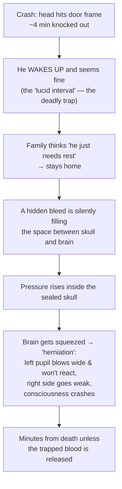
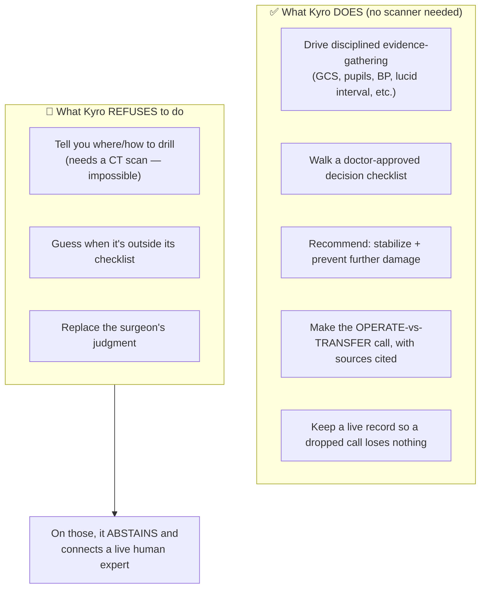
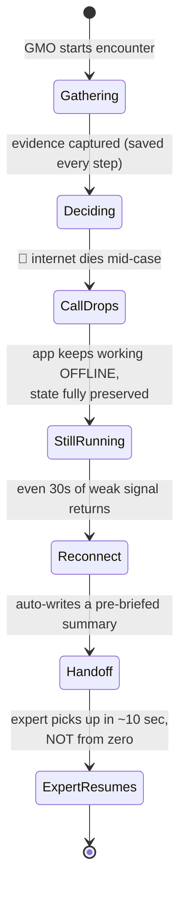
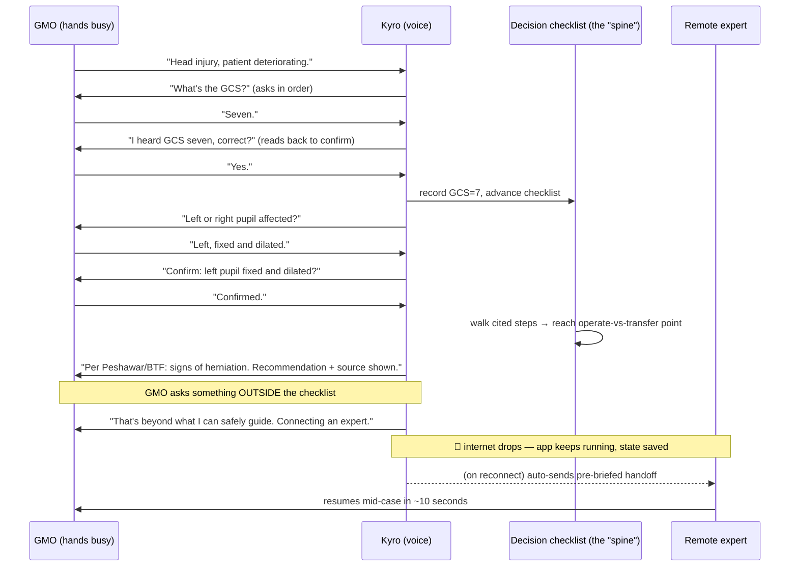

# 01 — The Product (Kyro, explained from zero)

> **Who this is for:** Aniket and Gowrish — and anyone who joins us. It assumes you know **nothing** about brain surgery, traumatic brain injury, machine learning, or cloud computing. By the end you'll understand *what Kyro is, who uses it, what it does, and why it matters.* The tech is explained in `02`, `03`, and `04`.
>
> **One-line version:** Kyro is a **phone app** that helps a non-specialist doctor handle a brain-bleed emergency **when there's no internet, no scan, and no brain surgeon** — by asking the right questions in the right order, walking a doctor-approved checklist, and **never losing its place when the phone call to a distant expert drops.**

---

## 1. The name

**Kyro** comes from **Chiron** — in Greek myth, the wise centaur who *taught* the healer Asclepius. Asclepius went on to cure the sick and dying **without Chiron in the room** — he carried what Chiron gave him.

That's the whole idea in one image: **Kyro is the expert's knowledge, carried into every room — offline, when the call drops.** It is not the surgeon. It's what the surgeon would have told you, available when the surgeon can't be reached.

> Tagline we use: *"The call dropped twice. Ours doesn't."*

---

## 2. The problem, through one real patient: "HM"

Everything we build is anchored to one real case from the hackathon. Understanding it is the fastest way to understand the product.

### Who he is
**HM** is a **31-year-old apricot farmer** in a remote mountain village in **Gilgit-Baltistan, rural Pakistan**. He is the only earner for a family of six. The nearest:
- **nurse-led clinic** has no lab and no scanner,
- **general doctor (GMO)** is **45 km** away on an unpaved road,
- **trauma hospital with a brain surgeon** is **200 km** away.

### What happened — and why it's so dangerous

A pickup truck rolls over. HM hits his head and is knocked out for about 4 minutes. Then something that *looks* reassuring but is actually deadly happens — the cascade below.

Let's define every scary word in plain language:

| Term | Plain meaning |
|---|---|
| **TBI** (traumatic brain injury) | Any injury to the brain from an outside force — a crash, a fall, a blow. |
| **Epidural hematoma (EDH)** | A pocket of blood pooling **between the skull and the tough outer covering of the brain** (the *dura*). Usually a torn artery. This is HM's specific injury. |
| **Lucid interval** | The cruel "looks fine" window between the injury and the collapse. Doctors call EDH a **"talk and die"** injury because of it. |
| **GCS** (Glasgow Coma Scale) | A 3–15 score for how awake someone is. **15 = fully alert. 8 or below = comatose** (can't protect their own airway). HM dropped **14 → 7**. |
| **Blown / fixed pupil** | One pupil is wide open and won't shrink in light. It means the rising pressure is pinching a specific nerve — a **red-alert sign the brain is being crushed**. |
| **Herniation** | The brain physically being pushed/squeezed out of its normal position by the pressure. The final, fatal stage if nothing is done. |
| **Monro-Kellie doctrine** | *The key mental model.* The skull is a **sealed, rigid box**. Brain + blood + fluid fill it exactly. Add a fourth thing (a bleed) and something else **must** get crushed — there's nowhere for it to go. |
| **Burr hole** | A small hole drilled in the skull to **let the trapped blood escape**, instantly relieving the pressure. |
| **Hudson brace** | A hand-crank drill (like a carpenter's tool) — what you use when there's no power and no surgical drill. |
| **GMO** (general medical officer) | A general doctor. **Not** a brain surgeon. Our user. |

### Why EDH is the *winnable* emergency
Here's the hopeful part. Draining an epidural hematoma is **mechanically simple and dramatically effective** — the moment the blood is released, the pressure drops, the pinched nerve recovers, and the pupil shrinks back. The barrier isn't surgical skill. **The barrier is recognition, timing, and access.** That's exactly the gap software can attack.

### What actually happened to HM
A GMO — general surgical training, **zero neurosurgery experience** — drilled an emergency burr hole with a hand-crank drill, **guided by a phone call to a distant neurosurgeon that kept dropping**. It worked. HM lived.

But he was left with **permanent damage**: memory and attention problems, right-side weakness, personality changes, depression, a seizure 6 months later — and **no rehabilitation services within 200 km**, plus social stigma and medical debt.

### Where the system broke (every stage is a possible product)

```mermaid
flowchart LR
    P1["Years before:<br/>repeated sport head knocks<br/>dismissed as 'stress'"] --> P2["Injury:<br/>looks fine → rest at home"]
    P2 --> P3["Deterioration:<br/>no ambulance, no ER number"]
    P3 --> P4["Transport:<br/>200 km = death if moved"]
    P4 --> P5["Diagnosis:<br/>NO scanner, NO labs"]
    P5 --> P6["SURGERY:<br/>GMO + dropping phone call"]
    P6 --> P7["After surgery:<br/>no monitor, infection"]
    P7 --> P8["Rehab:<br/>none for 200 km"]
    style P6 fill:#ffd6d6,stroke:#c0392b,stroke-width:3px
```

**We chose the red box: the surgery moment, specifically the dropping phone call.** That's "pain point #6 — surgical task-shifting."

---

## 3. What Kyro is (and what it is deliberately NOT)

### The single most important boundary: the "imaging wall"
You cannot know **where** to drill a hole in someone's skull without a **CT scan** to show where the blood is. **No software can create a scan out of thin air.** So Kyro **does not** try to guide the drilling. Anyone who claims that is lying, and the expert judges will know instantly.

Instead, Kyro is a **decision co-pilot**. It owns the parts you *can* do without a scanner, and it **hands off** the part you can't.

> **Say it like this:** Kyro is a **"Verifiable Workflow Automator + Grounded Synthesizer."** In plain words: it **runs a trustworthy checklist and explains the answer with its sources** — it does **not** "think like a surgeon." (Why we're so careful about wording: our judges are mostly medical doctors and neurosurgeons who are *skeptical of AI*. The fastest way to lose them is to claim an AI reasons like a surgeon.)

---

## 4. The heart of it: **"Continuity, not knowledge"**

This is the one idea that makes Kyro different from every existing tool. Read it twice.

The GMO in the real case **succeeded** — he had fragments of guidance. The thing that nearly killed HM wasn't *missing knowledge*. **It was that the lifeline broke mid-emergency — the call dropped, twice.** Every existing tool (video teleconsult, tele-mentoring, online guidelines) assumes a working internet connection **at the exact moment it doesn't exist.**

So Kyro's hero feature is a **"procedure state machine"** — think of it as a **black box flight recorder for the emergency.** It continuously remembers:
- every fact gathered so far (GCS, pupils, drugs given, time since injury),
- where you are in the decision checklist,
- and exactly where any uncertainty came up.

When even a few seconds of connection returns, Kyro **auto-writes a handoff brief** so the next expert resumes *mid-emergency in about ten seconds*, instead of starting from scratch. Example of what it generates:

> *"Acute EDH suspected, 23 min elapsed. GCS 6 (was 14), left pupil fixed & dilated, BP 160/90, mannitol given 18 min ago, lucid interval reported, right-sided weakness. Reached the operate-vs-transfer checkpoint; GMO flagged uncertainty. Needs: expert confirmation on operate-vs-transfer."*

**That's the differentiator.** Not "smarter than a flowchart." **Continuity + disciplined questioning + hands-free voice + sources you can check.**

---

## 5. The five features (the "five jobs")

Kyro does exactly these five things, and nothing more:

1. **Drives structured evidence-gathering.** It *insists* on collecting the right facts in the right order: GCS, pupils, blood pressure, lucid interval, weakness on one side, how the injury happened, time since injury. (In an emergency, asking the right questions *is* the intervention.)
2. **Walks a guideline decision tree.** A fixed, doctor-authored checklist where **every step cites a real medical guideline** (the *Peshawar Recommendations*, the *Brain Trauma Foundation*). No guessing.
3. **Recommends stabilization + the operate-vs-transfer decision — with sources.** It tells the GMO how to keep the patient alive and whether to operate locally or send the patient onward, and shows *why* (the citation).
4. **Abstains and connects a human when it hits its limit.** On anything outside the checklist — especially the surgical step — it **stops, says so, and routes to a live expert.** Knowing when *not* to act is its headline safety feature.
5. **Captures the encounter by voice.** The GMO's hands are busy/sterile, so it's **voice-driven** — and every encounter quietly builds a knowledge base for the future.

---

## 6. A full walkthrough — what using Kyro actually looks like

This is also our **live demo script**. Picture the GMO with HM in front of them, phone on the table, gloves on.

**Steps, in words:**
1. GMO speaks; Kyro **asks for evidence in a fixed order** and **reads each critical answer back** to confirm it heard right (no flattering/yes-man behavior).
2. It **walks the cited checklist** to the operate-vs-transfer recommendation — each step shows its source.
3. The GMO pushes it past its limits; it **abstains and routes to a human** instead of inventing an answer.
4. We **simulate the call dropping** — the app keeps running, state intact.
5. On reconnect, the **handoff brief auto-generates.**
6. **We turn the WiFi off entirely — it still works.** *That WiFi-off moment is the demo.* It proves the thesis: continuity, not connectivity.

### The three "trust modes" (a traffic light)
Kyro is always honest about how much to trust it right now:

| Mode | When | What it gives you | Trust |
|---|---|---|---|
| 🟢 **Protocol** | Checklist reached a proper guideline endpoint, sources cover the case | Step-by-step, cited, guideline-concordant | **High — act on it** |
| 🟡 **Principles** | Partial / incomplete match | General stabilization advice, *labeled* "general guidance, not validated for your case" | Low — informs, doesn't direct |
| 🔴 **Stop** | Outside the checklist / missing critical facts | "STOP. Stabilize. Here's your escalation path." | Stabilize + escalate only |

**Hard rule:** an irreversible call like *operate* requires 🟢 — never a weak guess.

---

## 7. Who uses it, and where

- **User:** a **general medical officer or general surgeon** — a capable generalist who is **not** a neurosurgeon, working somewhere with unreliable power and internet.
- **First country (beachhead):** **Namibia** — we start with one country, one procedure, prove it, then expand. (We use HM's Pakistan story to *explain* the universal problem; we *deploy* where we have partners.)
- **The cost wedge:** Kyro runs **offline on 8–10-year-old Android phones** GMOs already own. No new hardware, no subscription to the internet. That's both the humanitarian point and the business point.

---

## 8. The business, in plain terms

- **Structure:** Kyro is the **philanthropic wing of "Exo"** (our broader effort). Mission-first, not investor-first.
- **How it's funded:** licensing to NGOs (e.g., Médecins Sans Frontières, Partners in Health), government health-ministry purchases, and grants (Gates, Wellcome, Fogarty).
- **The knowledge is data, not a secret model.** Updates ship as **versioned, signed files** — never as a retrained AI. Two tiers:
  - **Tier 0 — the canonical core** (official guidelines: WHO, Peshawar/WFNS, Brain Trauma Foundation). This is the life-or-death path. **Never crowdsourced.** We *open* this for trust.
  - **Tier 1 — verified expert contributions** (credential-checked, attributed). Enriches edge cases; **never overrides** Tier 0 on the critical path.
- **The moat (the defensible part):** every deployment logs **real moments of TBI uncertainty** — data that exists *nowhere* in the literature and **can't be copied without being deployed first.** That gap-log is simultaneously our roadmap, our research dataset, and our fundraising artifact.

---

## 9. How we prove it works (the short version)

Judges score **validation** heavily, and our audience is scientists. So every claim is a **number compared to a named baseline**, reported honestly. The headline proofs (full detail in the build/feasibility docs):

1. **Triage accuracy** (operate-vs-transfer) — and crucially, *when it's wrong, it errs toward the safe side* (transfer).
2. **Did it gather all the right facts?** (completeness ≥ 0.90)
3. **Does it match the guideline, and are the citations faithful?** (≥ 90%)
4. **The safety number:** does it abstain when it should? (≥ 95% of must-abstain cases)
5. **Better than an unaided generalist** (+20–25 points).
6. **The killer chart:** Kyro **with** its decision-checklist "spine" vs. **without** it — the accuracy *collapses* without the spine. This proves the safety lives in the **auditable checklist**, not in a mysterious AI.

---

## 10. What's in version 1 vs. later

| In v1 (the hackathon build) | Roadmap (explicitly cut for now) |
|---|---|
| Acute-TBI emergency pathway, deepest on **EDH** | Other neuro/TBI conditions |
| **English only** | Urdu and other languages (hard on-device) |
| The decision-checklist spine + small knowledge bundle + voice + abstention + the state machine | Fine-tuning a custom model (we use a stock one first) |
| A ~30-case benchmark + the spine-ablation chart | The full community-contribution portal / flywheel |
| Simulated expert handoff | Real masked-WhatsApp expert escalation |

---

### Where to go next
- **`02-ml-explained.md`** — the zero-knowledge crash course on the tech, and the whole 3-layer system told as one story.
- **`03-cloud-build-side.md`** — Aniket's side: how the knowledge bundle is built and signed.
- **`04-on-device-side.md`** — Gowrish's side: how the phone app runs it all offline.
