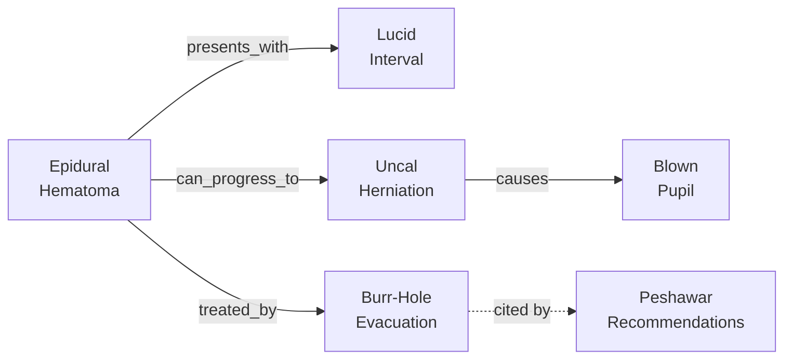
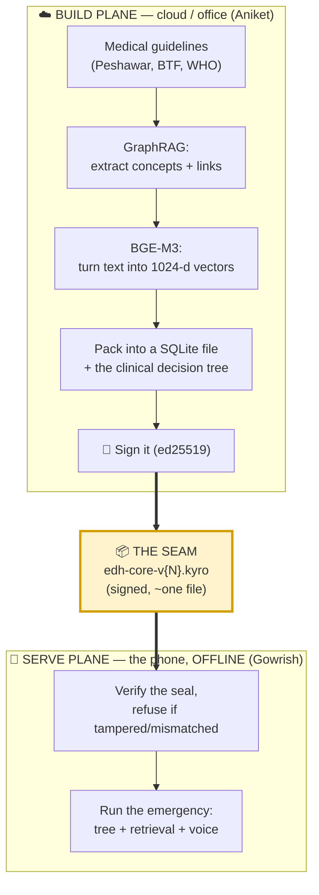
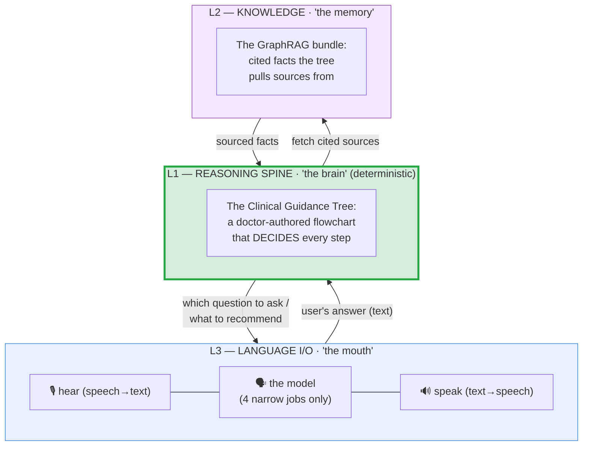
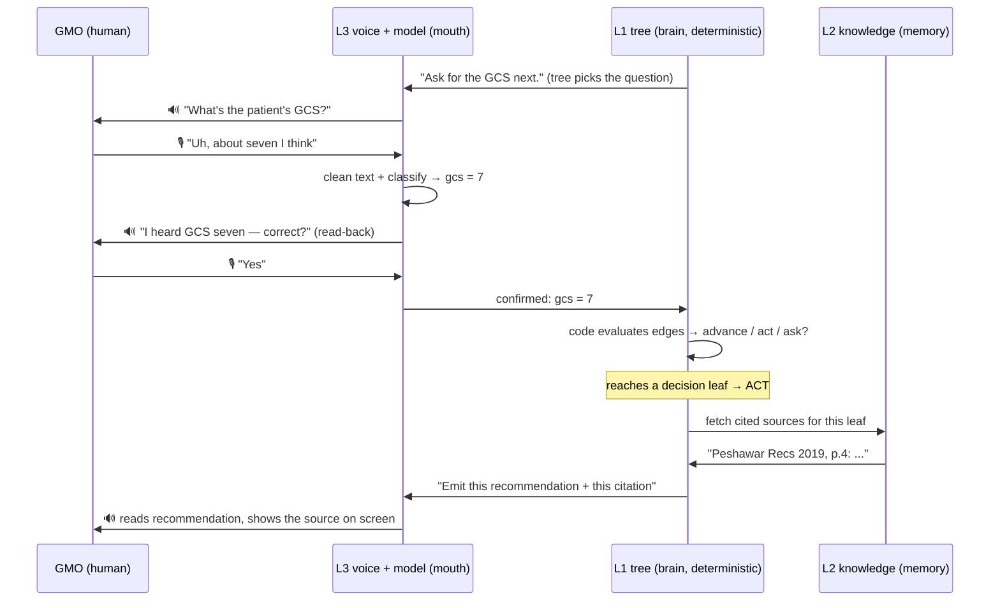

# 02 — The Tech, Explained From Zero

> **Who this is for:** both of us. It assumes you know **nothing** about machine learning, "the cloud," or how AI apps are built. We'll learn the handful of concepts you need (each with a plain analogy), then assemble Kyro's whole system as **one story**. The two "who-builds-what" deep dives are `03` (cloud, Aniket) and `04` (on-device, Gowrish). A **glossary** of every term is at the bottom — skim it any time.
>
> Read `01-product.md` first if you haven't — it explains *what* Kyro is and *why*. This doc explains *how*.

---

## Part A — The concepts you need (with analogies)

You only need to truly understand **eight** ideas. Here they are, each in plain English.

### 1. A "model" (or "AI model" or "LLM")
A **model** is a big file full of numbers that has read an enormous amount of text and learned the *statistical patterns* of language. When you give it some words, it predicts what words plausibly come next. That's it. **"LLM" = Large Language Model** — a big one, like ChatGPT.

> 🧠 **Analogy:** Think of the model as a **very well-read intern who never sleeps.** It has skimmed millions of pages, so it's fluent and fast — but it's also a confident *guesser*. It will happily make something up and say it with a straight face. You'd let this intern *draft an email* or *rephrase a sentence*. You would **never** let it decide whether to do brain surgery.

This single fact — *the model is a fluent guesser, not a reliable reasoner* — is the foundation of Kyro's entire design.

### 2. "On-device" vs "the cloud"
- **The cloud** = someone else's powerful computers in a data center, reached over the internet. Strong, but useless when there's no signal.
- **On-device** = running *directly on the phone in your hand*, no internet needed.

> ☁️ **Analogy:** The cloud is a **library across town** — huge, but you have to travel there. On-device is the **book in your backpack** — smaller, but it's with you in the mountains when the road is washed out.

Kyro's emergency app is **100% on-device** (the case has no internet). But *building* its knowledge happens **in the cloud** (that part can use the internet because it happens ahead of time, in an office). Keeping these two "planes" straight is the key to the whole architecture.

### 3. "Quantization" (why "Qwen-4B-Q4")
A capable model is normally too big and slow for a cheap phone. **Quantization** shrinks it by storing its numbers at lower precision.

> 📷 **Analogy:** Like saving a huge photo as a smaller JPEG. It takes far less space and loads faster, at the cost of being *slightly* fuzzier. "**Q4**" means "compressed to 4 bits per number" — small enough to fit on an old phone.

So **"Qwen-4B-Q4"** = *Qwen* (the model's family name) + *4B* (4 billion numbers — a small model) + *Q4* (compressed to 4-bit). It fits in roughly 2.5–3 GB of phone memory.

### 4. "Tokens/sec" and "RAM" (the phone's limits)
- **Token** = a chunk of text, roughly ¾ of a word. **Tokens/sec** = how fast the model produces words. Too slow = useless in an emergency.
- **RAM** = the phone's short-term working memory. The model, the speech recognizer, and the knowledge file all have to fit in it *at once*.

This is why the very first engineering task (the **"E0 spike"**) is just to *measure* tokens/sec and peak RAM on a **real** old phone — before building anything on top. If it won't fit or it's too slow, we find out on day one, not day three.

### 5. "Embeddings" and "vectors" (how a computer finds *meaning*)
This one is central, so go slow. A computer can't "understand" text, but it *can* compare numbers. An **embedding** turns a piece of text into a long list of numbers (a **vector**) such that **texts with similar meaning get similar numbers.**

> 🗺️ **Analogy:** Imagine a giant map where every sentence is a pin. The embedding decides *where* each pin goes, so that "blown pupil" and "dilated, unreactive pupil" land **right next to each other**, while "apricot harvest" lands far away. To find text relevant to a question, you embed the question (drop its pin) and **grab the nearest pins.** That's "semantic search."

Two consequences you'll hear constantly:
- The thing that turns text into the vector is the **embedder**. Kyro's is called **BGE-M3**, and it produces a vector of **1024 numbers** (we say "1024-dimensional" or "1024-d").
- **The map only works if everyone uses the same map-maker.** If the cloud builds the map with BGE-M3 but the phone searches it with a *different* embedder, every pin is in the wrong place and search silently returns garbage. **This is the project's #1 killer** — more on it below.

### 6. "RAG" and "GraphRAG" (giving the model trustworthy facts)
Because the model is a guesser (idea #1), we don't *ask it to know* medical facts. Instead we **look up** the real facts and **hand them to it** to phrase. That technique is **RAG** = *Retrieval-Augmented Generation*: **retrieve** the right facts, then let the model **generate** prose *from those facts*.

**GraphRAG** is a smarter version. Instead of storing facts as a loose pile of paragraphs, it organizes them as a **knowledge graph**: concepts are **nodes**, and labeled relationships are **edges** between them.

> 🕸️ **Analogy:** RAG is a **shoebox of index cards**. GraphRAG is a **concept map on the wall with string connecting related cards** — you can follow the strings to pull in *related* facts, and every card has a *source written on the back*. That "source on the back" is what lets Kyro **cite** every recommendation.

### 7. "Deterministic" vs "the model" (the single most important distinction)
- **Deterministic** = plain computer code/logic that does the **exact same thing every time**, and you can read it and predict it. A flowchart a calculator follows. `IF gcs ≤ 8 THEN intubate`. No guessing.
- **The model** = the fluent guesser from idea #1. Different, fuzzy, sometimes wrong.

> ⚖️ **Analogy:** Deterministic code is a **train on rails** — it can only go where the track goes, and you can see the track. The model is a **brilliant but impulsive driver** — fast and flexible, but you can't be sure where it'll go.

Kyro's core design decision — **"the inversion"** — is: **put the life-or-death reasoning on rails (deterministic), and let the model only do the talking.** We'll see exactly how in Part B.

### 8. "Signing" (making a file tamper-proof)
How does a phone in Namibia *trust* a knowledge file it downloaded? With a **digital signature** — a bit of cryptography.

> 🔏 **Analogy:** Like a **wax seal** on a letter. The cloud "stamps" the file with a secret **private key**. Anyone can check the stamp with the matching public **public key**. If even one byte of the file changed, the seal breaks and the phone refuses it. Kyro uses a scheme called **ed25519**, and the phone is pre-loaded with the one public key it trusts.

That's all the theory. Now the system.

---

## Part B — Kyro's whole system, as one story

Kyro has **two worlds** connected by **one file**:

1. **The build plane** (the cloud / an office, with internet) — where the knowledge file is *made*. *Aniket's domain.*
2. **The serve plane** (the phone, offline, in the emergency) — where it's *used*. *Gowrish's domain.*
3. **The seam** — the single file that crosses between them: a **signed SQLite bundle** named **`edh-core-v{N}.kyro`** (the `{N}` is a version number).

Everything heavy and internet-dependent happens **once, ahead of time, on the left.** The phone on the right just **opens a finished, sealed file and runs.**

### The three layers inside the phone

When you look *inside* the running app, it's built in **three layers**. The names matter; we use them constantly.

| Layer | Nickname | What it is | Who builds it |
|---|---|---|---|
| **L1 — Reasoning spine** | **the brain** | A hand-written, doctor-signed **decision tree** (a flowchart). **Deterministic code walks it and makes every decision.** | tree authored by the team + mentor; runtime by **Gowrish** |
| **L2 — Knowledge** | **the memory** | The **GraphRAG bundle** of cited facts. Supplies *sources*, never *decisions*. | built by **Aniket** (cloud), used by **Gowrish** (phone) |
| **L3 — Language I/O** | **the mouth** | The **model + speech-in + speech-out.** Talks to the human. Does **not** decide anything. | **Gowrish** (phone) |

### "The inversion" — the one idea to remember

In a *typical* AI app, the **model is the brain**: it reasons freely, and you bolt on guardrails to catch it. Kyro **inverts** that:

> **The deterministic tree is the brain. The model is only the mouth.**
> Code decides *what happens*. The model only *listens and talks*.

The model has exactly **four narrow jobs**, none of them load-bearing:
1. **Clean up** the messy speech-to-text (e.g., fix "diastlik pupil" → "dilated pupil").
2. **Classify** the GMO's spoken answer into a category the tree understands (e.g., "yeah it's blown" → `pupil = fixed`).
3. **Phrase** the next question the tree wants to ask, in natural words.
4. **Write up** the final recommendation **from the leaf the tree already reached**, with its citation.

Notice what the model is **never** allowed to do: decide whether to operate, decide what's wrong, or decide when to stop. **The rails decide those.** The model just makes the rails *speak human*.

**Why build it upside-down like this?** Three reasons, all aimed at the skeptical-doctor audience:
- **Auditability.** Every step of the tree shows its source. A model's numbers can't cite themselves. *"Glass box, not black box."*
- **Currency.** Guidelines change. We update Kyro by shipping a **new data file** — not by retraining an AI. Knowledge is *data*, never baked into the model.
- **Safety.** A small 4-billion model is *not* a reliable medical reasoner (a fine-tuned *8*-billion model scored only ~42% on a US medical exam). So we **forbid it from reasoning** on the critical path. The train stays on the rails.

### How the system *abstains* — and why it's NOT based on the model "feeling unsure"

The headline safety feature is knowing when **not** to act. A naïve design would ask the model "how confident are you?" and stop when it's unsure. **Kyro deliberately does NOT do this**, because of a brutal research finding:

> A small model's self-reported confidence is **near-useless** at predicting whether it's actually right — about as good as a coin flip (a measure called **AUROC ≈ 0.5**). We *cite this against ourselves.*

So instead of trusting a feeling, Kyro abstains on **hard, deterministic structure**:
- **(a)** the tree must actually reach a proper, guideline-sanctioned endpoint — no endpoint, no recommendation;
- **(b)** **out-of-bounds rules** fire on any missing required fact, contradictory vital signs, out-of-range value, or **any input the tree doesn't recognize**;
- **(c)** it **cannot finish** while a critical fact (GCS, pupils, etc.) is still missing.

And before any critical fact even enters the tree, the app **reads it back** to the human for confirmation — *"I heard left pupil fixed, correct?"* — so a mis-heard word can't silently corrupt a life-or-death branch.

### The speed rule (why Kyro feels instant, not sluggish)

Fancy AI techniques that sample many times or run many "agents" are **banned from the critical path.** One published multi-agent method takes ~70 seconds *per question* on a powerful server GPU — that's *minutes per case* on a phone. Unacceptable in an emergency. Kyro answers in single, short passes. (The one exception: the team may sample 2–3 times on the *single* operate-vs-transfer checkpoint, where the extra care is worth a second or two.)

### Putting it together: one full turn of the loop

Here's what actually happens, end to end, for a single question-and-answer during the emergency:

The loop repeats — **ask → confirm → advance** — until the tree reaches an endpoint and **acts** (recommend) or **abstains** (stop + escalate). Every fact gathered is saved the instant it's confirmed, which is what makes the **dropped-call recovery** (from `01`) possible: the state is *always* on disk.

### Who owns which half

You picked "show the whole flow **and** a clear who-owns-what map." Here's the map; the full version with file names is in **`00-index.md`**.

```mermaid
flowchart LR
    subgraph A["🟦 ANIKET — build plane (cloud)"]
        A1["Gather guideline documents"]
        A2["Run GraphRAG + BGE-M3"]
        A3["Compile + 🔏 sign the .kyro bundle"]
        A4["Expert upload portal"]
    end
    subgraph SEAM["📦 the signed bundle"]
        SE["edh-core-v{N}.kyro"]
    end
    subgraph G["🟩 GOWRISH — serve plane (phone)"]
        G1["Verify + load the bundle"]
        G2["Walk the L1 tree (runtime)"]
        G3["Model I/O + voice (L3)"]
        G4["Retrieval over L2 + abstention + state machine"]
        G5["Run all the evaluations (supercomputer)"]
    end
    A --> SEAM --> G
```

The beauty of this split: **the file is the only thing you have to agree on.** As long as both sides honor the bundle's format (especially "BGE-M3, 1024-d"), Aniket can rebuild the knowledge a hundred times and Gowrish's app keeps working — they almost never have to coordinate.

---

## Part C — The one mistake that would sink the project

Worth stating on its own because the whole team must hold it: **the embedder must be byte-for-byte identical on both planes.**

Remember idea #5: search only works if the map-maker is the same on both sides. The cloud builds the knowledge map with **BGE-M3 (1024-d)**. The phone must search it with the **exact same** BGE-M3 (same weights, same normalization). If they differ even slightly:
- the app doesn't crash — it just **silently retrieves the wrong sources**,
- which is nearly impossible to debug (the numbers are opaque),
- and quietly destroys the "cited, trustworthy" promise that is the entire pitch.

That's why the bundle **stamps** its embedder name and dimension into a manifest, and the phone's loader **refuses any bundle that doesn't match** (`verify.py` literally returns FAIL on mismatch). It's not a guideline — it's an enforced gate. Treat "BGE-M3, 1024-d, both planes" as sacred.

---

## Glossary (every term, plain)

| Term | Plain meaning |
|---|---|
| **Model / LLM** | A big file of numbers that predicts likely next words; a fluent *guesser*, not a reliable reasoner. |
| **Qwen-4B-Q4** | The small, 4-billion-number model Kyro runs, compressed to 4-bit so it fits a cheap phone. |
| **Quantization / Q4** | Shrinking a model by storing its numbers at lower precision (smaller + faster, slightly fuzzier). |
| **On-device** | Running on the phone itself, no internet. |
| **Cloud / build plane** | Powerful internet-connected computers used *ahead of time* to build the knowledge. |
| **Serve plane** | The offline phone, where the emergency actually happens. |
| **Token / tokens-per-sec** | A token ≈ ¾ of a word; tokens/sec = how fast the model talks. |
| **RAM** | The phone's short-term working memory; everything must fit in it at once. |
| **Embedding / vector** | A list of numbers representing a text's *meaning*, so similar texts sit near each other. |
| **BGE-M3** | The specific *embedder* Kyro uses; outputs a 1024-number vector. **Must be identical on both planes.** |
| **1024-d** | "1024-dimensional" — the embedding vector has 1024 numbers. |
| **Semantic search** | Finding text by *meaning* (nearest vectors), not exact keywords. |
| **sqlite-vec** | A plug-in that lets the SQLite database do that nearest-vector search. |
| **RAG** | *Retrieval-Augmented Generation*: look up real facts, then let the model phrase them. |
| **GraphRAG** | RAG where facts are organized as a graph (nodes + labeled edges) with sources attached. |
| **Knowledge graph** | A web of concepts (**nodes**) connected by relationships (**edges**). |
| **Node / edge / leaf** | A concept/step (node), a link/branch (edge), an endpoint/conclusion (leaf). |
| **Deterministic** | Plain logic that does the same predictable thing every time; the opposite of the model's guessing. |
| **CGT (Clinical Guidance Tree)** | Kyro's hand-authored, doctor-signed decision flowchart — the **L1 spine**, the "brain." |
| **MedDM "IEET"** | The format the tree follows: **I**nformation → **E**valuation → **E**scalation → **T**reatment. |
| **The inversion** | Kyro's core choice: the deterministic tree reasons; the model only does language I/O. |
| **Abstain** | Refuse to recommend and escalate to a human — gated on *structure*, not model confidence. |
| **AUROC ≈ 0.5** | A score showing model self-confidence is no better than a coin flip at knowing if it's right. |
| **Read-back confirmation** | The app repeats a critical fact for the human to confirm before using it. |
| **SQLite** | A whole database that lives in a single ordinary file — perfect for shipping to a phone. |
| **Bundle / `.kyro`** | The single signed SQLite file that carries all of Kyro's knowledge + tree. **The seam.** |
| **Manifest** | The bundle's "label" row: version, embedder name/dim, language, signature. |
| **Signing / ed25519** | A tamper-proof digital "wax seal" on the bundle; the phone refuses a broken seal. |
| **Trust tier (0/1/2)** | Honesty label on a fact: 0 = verified guideline, 1 = standard-but-unverified, 2 = labeled local default. |
| **Provenance / citation** | The source written "on the back" of every fact, so recommendations are auditable. |
| **GraphRAG parquet** | The raw table files Microsoft GraphRAG outputs, which Aniket's compiler reads. |
| **llama.rn** | The software that runs the model *inside* a React Native phone app. |
| **whisper.cpp** | The offline speech-to-text (the ears). |
| **Piper / OS-TTS** | The offline text-to-speech (the voice). |
| **React Native** | The framework for building the phone app (one codebase, Android + iOS). |
| **E0 spike** | The first task: measure the model's speed + RAM on a real old phone before building. |
| **Procedure state machine** | The "flight recorder" object `evidence + hypotheses + trajectory` that makes dropped calls recoverable. |
| **MIMIC-IV** | A large real-world hospital dataset (used for one tier of evaluation; needs credentialing). |

---

### Where to go next
- **`03-cloud-build-side.md`** — Aniket's deep dive: the real pipeline that builds and signs the bundle.
- **`04-on-device-side.md`** — Gowrish's deep dive: the app that runs it all offline.
- **`00-index.md`** — the map, the ownership table, and current status.
