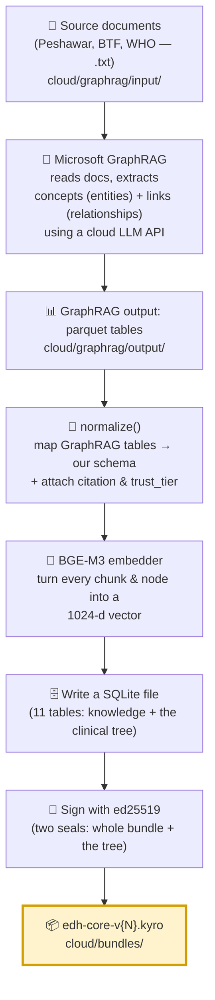
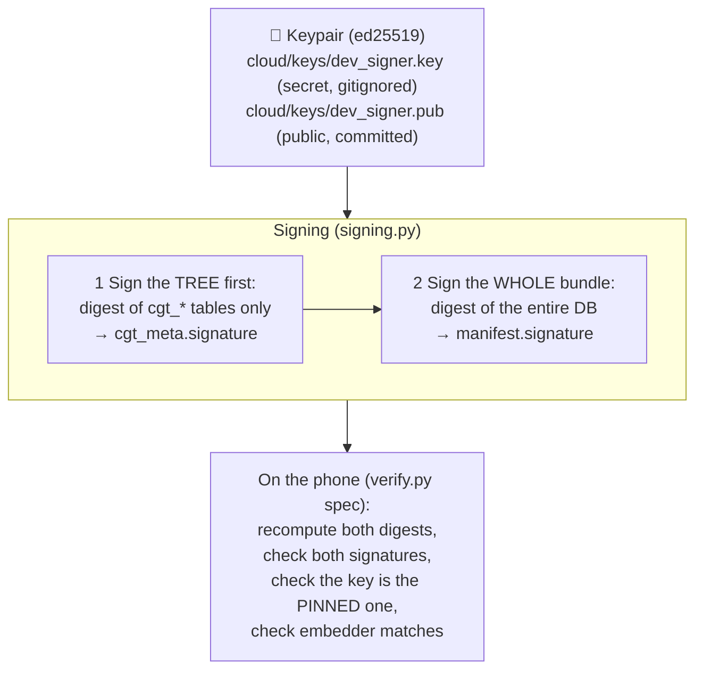

# 03 — The Cloud / Build Side (Aniket's deep dive)

> **Who owns this:** **Aniket.** **Where the code lives:** `cloud/`. **What you produce:** one signed file — `edh-core-v{N}.kyro` — that Gowrish's phone app loads.
> **Read `02-ml-explained.md` first** for the concepts (embeddings, GraphRAG, signing, the seam). This doc is the hands-on tour of the *real, already-written* pipeline.
>
> **Your job in one sentence:** *Turn a pile of medical guideline documents into a small, searchable, source-cited, tamper-proof data file the phone can trust offline.* No supercomputer needed — a cloud LLM API and an ordinary laptop are enough (the knowledge graph is only ~160 concepts).

---

## 1. The pipeline at a glance



The whole thing is plain Python in `cloud/kyro_bundle/`. There are **two entry-point scripts** (we'll cover both): a **mock** builder that works *today* with zero AI dependencies, and the **real** builder that uses GraphRAG + BGE-M3.

---

## 2. Step by step

### Step 1 — Collect the sources
Drop the canonical guideline documents (as `.txt`) into `cloud/graphrag/input/`. The **filename matters**: it's how the system knows the source and how trustworthy it is. For example, a file stemmed `peshawar_recommendations_2019` is recognized as *"WFNS Peshawar Recommendations 2019"* at **trust tier 0** (canonical). This mapping lives in **`sources.py`**:

```python
SOURCE_REGISTRY = {
  "peshawar_recommendations_2019": ("WFNS Peshawar Recommendations 2019", 0),
  "btf_surgical_guidelines":       ("Brain Trauma Foundation, Surgical Management of TBI", 0),
  "btf_guidelines_4th_ed":         ("Brain Trauma Foundation Guidelines, 4th ed.", 0),
  "who_tbi":                        ("WHO Guidelines on Traumatic Brain Injury", 0),
}
DEFAULT_SOURCE = ("Uncited source (review)", 1)   # anything unknown → provisional
```
> 🛠️ **Your TODO:** this map only has 4 entries. As the real EDH corpus lands, add each guideline with a precise (ideally page-level) citation. Unknown sources silently fall to tier 1 ("review"), which you don't want on the critical path.

### Step 2 — GraphRAG extracts the concepts
**Microsoft GraphRAG** (config in `cloud/graphrag/settings.yaml`) reads the documents and, using a cloud LLM, pulls out:
- **entities** — the concepts (e.g., *Extradural Haematoma*, *Uncal Herniation*), each typed (`condition`, `sign`, `procedure`, `guideline`, …),
- **relationships** — the links between them (e.g., *EDH → can_progress_to → Herniation*),
- **text_units** — the chunks of source text the concepts came from,
- **community_reports** — GraphRAG's auto-summaries of clusters of concepts.

It writes these as **parquet** files (a table format) into `cloud/graphrag/output/`. You run it with:
```bash
graphrag index --root cloud/graphrag
```

> 💡 **Important nuance:** GraphRAG *also* makes its own embeddings — **but we throw those away.** Why? Because the phone must use *our* embedder (BGE-M3). If we shipped GraphRAG's embeddings, the phone couldn't reproduce them and search would break. So **GraphRAG is used for extraction only; we re-embed everything ourselves** in Step 4. This is the single most important design decision on your side.

### Step 3 — `normalize()` maps GraphRAG → our schema
GraphRAG's column names drift between versions, so **`graphrag_io.py`** reads the parquet files tolerantly (it knows both v1 names like `create_final_entities` and v2 names like `entities`) and hands back clean tables. Then **`normalize()`** (in `build_bundle.py`) converts them into our exact format and **attaches provenance**:

| GraphRAG table | becomes our… | trust_tier rule |
|---|---|---|
| `text_units` | `chunks` (kind=`text_unit`) | from `resolve_source(document)` |
| `community_reports` | `chunks` (kind=`community_report`) | always **1** (machine-summarized, not guideline-grade) |
| `entities` | `nodes` | **min** of the tiers of the chunks that support it (most authoritative wins) |
| `relationships` | `edges` | (carries `source_chunk_id` back to the supporting chunk) |
| `communities` | `node_community` | — |

### Step 4 — Embed everything with BGE-M3
Every chunk's text and every node's description is turned into a **1024-d vector** by **`embedders.py`**'s `BgeM3Embedder` (loads `BAAI/bge-m3` via the `FlagEmbedding` library, encodes dense, L2-normalizes). These vectors are what make the phone's semantic search work.

### Step 5 — Write the SQLite bundle
**`schema.py`** is the single source of truth for the file format (11 tables, created in a fixed order). `bundle_writer.py` opens the file (loading the `sqlite-vec` extension so vector tables work), inserts all the knowledge, then **ingests the clinical tree** from `spine/edh-cgt.sql` (Gowrish/mentor's authored decision tree — see `04` and the spine docs).

### Step 6 — Sign it (twice)
`signing.py` applies **two** ed25519 signatures (see §4). Output lands in `cloud/bundles/edh-core-v{N}.kyro`. Done.

---

## 3. What's actually inside the bundle (the 11 tables)

This is *the seam* — the contract with Gowrish. (Full column list is in `00-index.md`; here's the shape.)

**The label:**
- **`manifest`** — one row: `bundle_id`, `version`, `scope`, **`embedder_id`**, **`embedder_dim`**, `lang`, `graphrag_version`, `sqlite_vec_version`, `created_at`, `signature`, `signer_pubkey`. *(The bolded two are the make-or-break fields — see §5.)*

**The knowledge (L2) — what GraphRAG + BGE-M3 produce:**
- **`chunks`** — raw source text + `source_citation` + `trust_tier`.
- **`chunk_vec`** — a `vec0` virtual table: `chunk_id` + `embedding FLOAT[1024]`.
- **`nodes`** — the concepts (name, type, description, trust_tier).
- **`node_vec`** — `node_id` + `embedding FLOAT[1024]`.
- **`edges`** — `src_id`, `dst_id`, `relation`, `weight`, `source_chunk_id`.
- **`node_community`** — which cluster each node belongs to.

**The clinical tree (L1) — authored by hand, ingested from `spine/edh-cgt.sql`:**
- **`cgt_nodes`** — the 48 decision/gather/leaf nodes (with `action`, `source_citation`, `trust_tier`).
- **`cgt_edges`** — the 73 branches (each a Boolean `condition`).
- **`cgt_strings`** — the human wording per node, per language (English only in v1).
- **`cgt_meta`** — `root_id`, `version`, and the tree's own `signature`.

> You don't author the tree — Gowrish/the mentor do, in `spine/edh-cgt.sql`. Your compiler just **loads and signs** it into the bundle. But your bundle is its delivery vehicle, so the format must match `schema.py` exactly.

---

## 4. Signing & verification — the two wax seals



**How the digest is computed (this is the cross-language contract):** blank out the signature fields, dump the whole database to ordered SQL text with SQLite's `iterdump()`, and take its **SHA-256**. Because `iterdump()` is deterministic across operating systems and languages, Gowrish's phone (in JavaScript/native) computes the *same* digest and the signature checks out.

**Why two signatures?** So a neurosurgeon can re-sign **just the clinical tree** (`cgt_*`) after editing it, **without** rebuilding the whole knowledge graph. The tree is the credibility core; it changes on a different schedule than the knowledge.

**`verify.py`** is your reference implementation — it runs four checks, and Gowrish must mirror it exactly on-device:
1. ✅ manifest signature valid?
2. ✅ tree (`cgt_*`) signature valid?
3. ✅ is the signer the **pinned** public key? (the phone trusts *one* key, never a key embedded in the file)
4. ✅ does the bundle's embedder (`embedder_id`/`embedder_dim`/`sqlite_vec_version`) match the device's? → **this is the #1-killer guard.**

---

## 5. The one rule you can never break

From `02`: **the embedder must be byte-identical on both planes.** Your `BgeM3Embedder` (cloud) and Gowrish's BGE-M3 inside `llama.rn` (phone) must produce the *same* 1024 numbers for the same text. If they don't, search silently returns wrong sources and the "cited, trustworthy" pitch collapses — with no crash to warn you.

The bundle defends against this by **stamping** `embedder_id="bge-m3"` and `embedder_dim=1024` into the manifest, and `verify.py` **refuses** any mismatch. But that only catches a *wrong name* — it can't catch two BGE-M3s that disagree numerically. So the real safeguard is a **parity test you must run**: embed a test string on your side and on the phone, and assert the two vectors are ~identical (cosine ≈ 1.0). **Do this before trusting any real bundle.**

---

## 6. The three build modes (and how to run them)

The code ships in three modes so the team is never blocked:

| Mode | Command | Embedder | Needs GraphRAG/AI? | Output | Purpose |
|---|---|---|---|---|---|
| **Mock** | `python -m kyro_bundle.build_mock` | `HashEmbedder` (`mock-hash-1024`) | ❌ No | `edh-core-v0-mock.kyro` | Hand-written 8 chunks / 8 nodes / 7 edges + the **real** tree. Unblocks Gowrish *today*. |
| **Selftest** | `python -m kyro_bundle.build_bundle --selftest` | `HashEmbedder` | ❌ No | `edh-core-selftest.kyro` | Fabricates tiny fake GraphRAG output to prove `normalize()` works end-to-end. |
| **Real** | `python -m kyro_bundle.build_bundle --root cloud/graphrag --version 1` | `BgeM3Embedder` (`bge-m3`) | ✅ Yes | `edh-core-v1.kyro` | The production bundle from the real corpus. |

> 🔍 **What's `HashEmbedder`?** A *fake* embedder for wiring tests: it turns text into a vector by hashing it (SHA-256 → seeded random numbers → normalize). It's **deterministic** (same text → same vector everywhere), so it's reproducible — but it's **not semantically meaningful** (nearest-neighbor results are gibberish). Crucially, it's named `mock-hash-1024`, *not* `bge-m3`, so the phone's guard **correctly rejects** a mock bundle in production. That's intended: mock bundles are for plumbing, never for clinical use.

To verify any bundle:
```bash
python -m kyro_bundle.verify cloud/bundles/edh-core-v0-mock.kyro
# [PASS] manifest signature   [PASS] CGT signature
# [PASS] pinned pubkey match   [FAIL] embedder match (mock-hash vs bge-m3 — EXPECTED for mock)
```

---

## 7. Where the dependencies fit

`cloud/requirements.txt`:
- **Core (needed for mock + selftest, already used):** `numpy`, `sqlite-vec` (the vector tables — **pin the exact version**, it must match the phone), `cryptography` (ed25519), `pandas` + `pyarrow` (read parquet).
- **Step 3 (install when you build for real):** `FlagEmbedding` (the BGE-M3 model), `graphrag` (Microsoft GraphRAG).
- **Later cloud services (your roadmap, not in the build script yet):** `fastapi`/`uvicorn` (APIs), `pymupdf` (PDF ingestion), `presidio` (strip patient info), `supabase` (database).

---

## 8. Current status & your roadmap

### ✅ Works today (committed and verifying)
- The full bundle **format** (`schema.py`) and writer/signer/verifier.
- The **mock bundle** `edh-core-v0-mock.kyro` — builds, signs, verifies, carries the **real** clinical tree. Gowrish can wire against it now.
- The **selftest bundle** `edh-core-selftest.kyro` — proves the GraphRAG→bundle mapping works.
- ed25519 signing (two seals) + the cross-language digest rule.
- The committed public key `cloud/keys/dev_signer.pub` (the phone's pinned trust root).

### 🛠️ Your open work (roughly the "C-stream" from the task split)
| ID | What | Status |
|---|---|---|
| **C3** | Run the **real** GraphRAG index over the EDH corpus → produce `edh-core-v1.kyro` | logic done; **awaiting corpus in `cloud/graphrag/input/`** |
| **C3** | **Verify BGE-M3 parity** cloud↔phone (cosine ≈ 1.0 test) | **not done — do this before any real bundle** |
| — | Flesh out `sources.py` with page-level citations as the corpus lands | 4 of N done |
| **C1** | Ingestion API (upload → parse PDF → chunk) — FastAPI + PyMuPDF | not started |
| **C2** | De-identify (strip patient info) — Presidio | not started |
| **C4** | Master store (accounts, provenance, review state) — Supabase | not started |
| **C6** | Distribution endpoint (`/bundles/latest?scope=edh-core`) | not started |
| **C7** | Expert portal (neurosurgeon upload → appears on device) — Next.js | not started (great demo) |
| **C8** | Synthetic dialogue generator (Tier-B eval data) | not started |
| — | Eval harness (fork `medLLMbenchmark`); **you code it, Gowrish runs it** on his supercomputer | not started |

### The critical path (what unblocks everything)
**Corpus → GraphRAG index (with BGE-M3) → signed `edh-core-v1.kyro`.** Everything else (portal, ingestion API, de-id) is enrichment around that spine. Get a real, parity-verified bundle into Gowrish's hands and the integration milestone is in reach.

---

### Where to go next
- **`04-on-device-side.md`** — what Gowrish's app does with the file you produce.
- **`00-index.md`** — the full schema columns, the ownership map, and status.
- The real code: `cloud/README.md` and `cloud/kyro_bundle/`.
