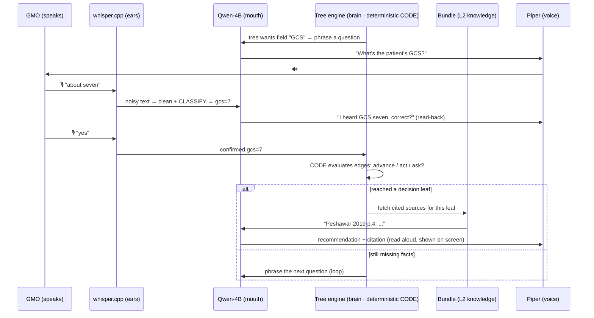
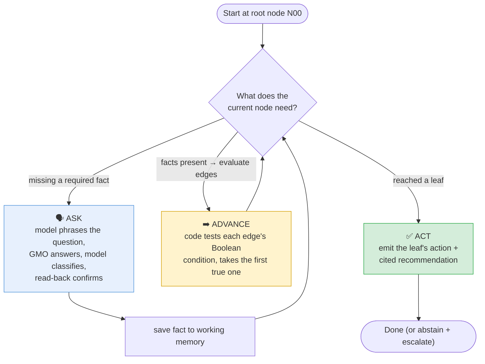
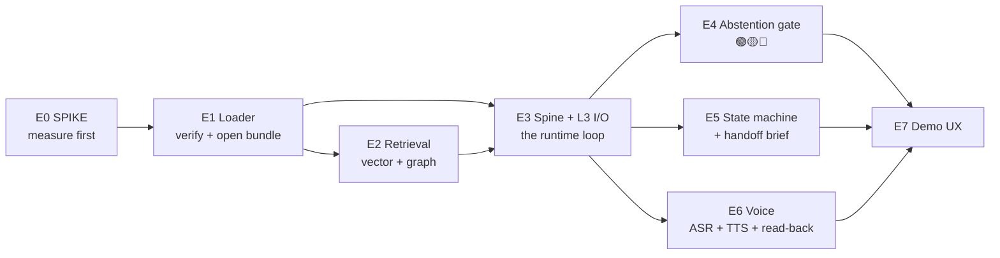

# 04 — The On-Device Side (Gowrish's deep dive)

> **Who owns this:** **Gowrish** (plus all heavy compute — the supercomputer, MIMIC, the evaluations). **What you build:** the phone app that loads Aniket's signed bundle and runs the whole emergency **offline**.
> **Read `02-ml-explained.md` first** for the concepts, and `03` for what's *in* the bundle you'll consume.
>
> **Your job in one sentence:** *Take the sealed `.kyro` file, prove it's genuine, and run a voice-driven emergency consult on a cheap offline phone — where deterministic code walks a doctor's decision tree, the model only listens and talks, and a dropped call loses nothing.*

---

## 1. The on-device stack

Everything runs inside one **React Native** app (one codebase → Android, the target). The pieces:

| Piece | Plain job | Library |
|---|---|---|
| **App shell + UI** | Screens, the demo flow | **React Native** (TypeScript) |
| **The model** | The "mouth" — 4 narrow language jobs | **Qwen-4B-Q4** via **llama.rn** (llama.cpp for RN) |
| **Ears (ASR)** | Speech → text, offline | **whisper.cpp** (a.k.a. whisper.rn) |
| **Voice (TTS)** | Text → speech, offline | **Piper** or the OS's built-in TTS |
| **The database** | Open the `.kyro` SQLite file | **op-sqlite** (a fast SQLite bridge for RN) |
| **Vector search** | "Nearest meaning" lookups | **sqlite-vec** extension, loaded via op-sqlite |
| **Query embedder** | Turn the live question into a 1024-d vector | **BGE-M3**, run through llama.rn — *must match Aniket's byte-for-byte* |

> ⚠️ Everything above runs **with the internet off.** That's the whole point — the case has no signal. The cloud (Aniket's side) only ever ran *ahead of time* to make the file.

---

## 2. The request lifecycle (one turn of the consult)

**Read this carefully:** the **tree engine is plain code**, and it is what decides advance/act/ask. The **model never decides** — it only *phrases*, *classifies*, and *writes up*. That separation is "the inversion" from `02`, and it's the thing that makes the system safe and auditable.

---

## 3. The runtime loop — how the tree is walked

The clinical tree (the **L1 spine**, `cgt_*` tables in the bundle) is walked by a **CDM-style loop** ("Clinical Decision Module"). At each node, your code makes one of three moves:

- **ASK** — a required fact is missing → the model phrases the tree's question, the GMO answers, the model **classifies** the answer into a value the tree understands, and the app **reads it back** to confirm before saving.
- **ADVANCE** — the facts are present → code evaluates the node's outgoing **edges** (each is a Boolean like `gcs_total <= 8`) and moves to the first one that's true.
- **ACT** — a **leaf** is reached → emit its **action** and the model writes up the recommendation *from that leaf*, with its citation.

### The four actions a leaf can carry
Every terminal leaf carries exactly one of these (this is the "4-action vocab"):

| Action | Meaning |
|---|---|
| **`GUIDE`** | Operating locally is indicated (transfer not feasible) → **connect a live expert** for supervised task-*sharing* and surface cited operative context. **It never gives drill-site guidance** — that step always abstains. |
| **`OBSERVE`** | Don't intervene now; serial neuro-exams; escalate if the patient deteriorates. |
| **`STABILIZE_TRANSFER`** | Not a local-operation case → stabilize, prevent secondary injury, refer onward, auto-build a handoff packet. |
| **`ABSTAIN_STOP`** | Refuse to guide (out of scope / can't localize / unresolvable input) → stabilize + escalate. |

### The model's four jobs — and its hard limits
The model (Qwen-4B-Q4) does **only**: (1) clean the ASR text, (2) classify the GMO's answer into the tree's categories, (3) phrase the next question, (4) write up the final recommendation **from the leaf the tree reached**. It is **forbidden** to decide traversal, diagnose, or choose the action. *Nothing load-bearing sits on it.*

### The working memory (the continuity primitive)
As the loop runs, you maintain one object — informally `evidence + hypotheses + trajectory`:
- **evidence** = every confirmed fact and derived fact (GCS, pupils, BP, `bilateral_fixed`, `extracranial_excluded`, …),
- **hypotheses** = the current node and whether a terminal was reached,
- **trajectory** = the audit trail of visited nodes and which edge fired.

Because every fact is saved the instant it's confirmed, **a dropped call loses nothing** — this object *is* the "flight recorder" that powers the handoff brief (§7).

---

## 4. Your components (the "E-stream", E0–E7)

### E0 — The spike (do this *first*, before building anything)
Measure, on a **real old phone** (not an emulator): **how fast does Qwen-4B-Q4 produce tokens, and what's the peak RAM?** Also confirm **op-sqlite can load sqlite-vec on Android.** If the model won't fit or is too slow, you find out on day one and drop to a 2B model or different quantization. No phone on hand → use a cloud device farm (Firebase Test Lab / AWS Device Farm).

> 💾 **RAM budget (8 GB target phone):** Qwen-4B-Q4 ≈ 2.7 GB, BGE-M3 ≈ 0.4 GB, whisper-small ≈ 0.5 GB → ~3.5–4.5 GB live (use a quantized KV cache, `q8_0`). On a 6 GB phone, drop to a smaller model. **E0 decides this by measurement.**

### E1 — Bundle loader & verifier
Download/sideload the `.kyro`, then **mirror `verify.py` exactly** (see `03 §4`): check both ed25519 signatures, confirm the signer is your **pinned** `dev_signer.pub`, and **reject** the bundle if `embedder_id`/`embedder_dim`/`sqlite_vec_version` don't match the device. Then open it with op-sqlite + sqlite-vec.

### E2 — Retrieval (GraphRAG "local search" on the phone)
When the tree needs sourced context for a leaf: embed the query with **BGE-M3 via llama.rn**, do a **sqlite-vec nearest-neighbor** lookup (≈8 nodes, ≈12 chunks), **expand along graph edges** + community reports to pull in related cited facts, and **prefer `trust_tier = 0`** (canonical) content. Output = the cited context the model writes up.

### E3 — Spine executor + L3 I/O
The runtime loop from §3: code-driven traversal of `cgt_*`, with the model doing its four jobs. Use a constrained/JSON output format so the model's classifications and write-ups are parseable, never free-form on the critical path.

### E4 — The graduated-assistance gate (🟢 / 🟡 / 🔴)
Decide, **deterministically**, how much help to give and how to badge it — **never** by asking the model how confident it feels (recall AUROC ≈ 0.5). **Default to helping, not abstaining:**

| Mode | Fires when | Behavior |
|---|---|---|
| 🟢 **Protocol** | tree reached a guideline-sanctioned leaf + retrieval covers it | act on the cited recommendation |
| 🟡 **Principles** *(the default)* | exact leaf not reached / partly outside the tree, but related cited knowledge exists | grounded guidance from the nearest cited nodes, *labeled* "extrapolated, not validated for your exact case" |
| 🔴 **Stop** | **only** where-to-cut (needs imaging) or invalid/contradictory input | "STOP, here's grounded stabilization + escalate" |

Compute the badge from **retrieval match × source trust-tier** (data coverage), not model confidence. A high-stakes action (operate) requires 🟢 — never a weak match; everything else degrades to 🟡, **never a dead end.** The tree's own structure (S1–S6 safety rules: completeness gate, contradiction guard, pediatric scope-out, the mannitol guard, etc.) is baked into `cgt_edges`, so much of this gate is *already encoded in the bundle you load.* **Now live:** the 3 graduated tweaks (N98/N22/N99) are **mentor-signed and active in spine v4** (`spine/edh-cgt.sql`) — N98 pediatric and N22 (transfer-infeasible) now give grounded 🟡 help instead of a bare abstain; `cgt_meta.version = 4`. Build against v4.

### E5 — Procedure state machine + handoff brief
Keep the working-memory object updated from the input stream. On reconnect (even 30 s of 2G), **auto-generate the pre-briefed handoff** so an expert resumes mid-case in ~10 seconds (see `01 §4`).

### E6 — Voice I/O
whisper.cpp (ASR) + Piper/OS-TTS, **English only in v1**. The non-negotiable behavior: **read back every critical field** before it enters the tree ("I heard left pupil fixed, correct?") — this is the anti-sycophancy guard that stops a mis-heard word from corrupting a life-or-death branch.

### E7 — Demo UX
The live flow: HM's case → voice evidence-gathering → walk the cited tree → hit an out-of-bounds input → watch it abstain → simulate a dropped call → reconnect → handoff brief → **turn WiFi off, still running.** *The WiFi-off moment is the demo.*

---

## 5. The hard rules (don't break these)

1. **The model never reasons on the critical path.** It cleans, classifies, phrases, and writes up. Code + the tree decide everything else.
2. **No multi-agent, no MCTS, no self-consistency** on the critical path — they cost minutes per case on a phone. (Allowed exception: 2–3 samples on the *single* operate-vs-transfer checkpoint.)
3. **Badge on structure, not confidence.** Default to grounded 🟡 help; hard-stop (🔴) only on where-to-cut or invalid/contradictory input. Never gate on the model's self-reported certainty.
4. **Read back every critical field** before it enters the tree.
5. **Reject any bundle that fails verification or whose embedder doesn't match.** Mirror `verify.py` precisely.

---

## 6. Evaluations (also yours — on the supercomputer)

All the validation runs on **your** compute (you hold the supercomputer + MIMIC/PhysioNet credentials). Aniket writes the harness (a fork of `medLLMbenchmark`); you run it against the signed bundle and produce the six headline numbers + **the spine-ablation collapse chart** (Kyro *with* vs *without* the L1 tree — the single most persuasive artifact). Tiers: **A** = mentor-signed EDH vignettes (the answer key lives in the spine + mentor pack), **B** = synthetic dialogues (engineering metric only), **C** = MIMIC-IV head-trauma slice — **start PhysioNet/CITI credentialing now**, it has days of lead time.

---

## 7. Current status & order of work

### ✅ Already available to you
- A **schema-correct, signed mock bundle** (`edh-core-v0-mock.kyro`) carrying the **real** 48-node clinical tree. You can wire E1–E5 against it today — it verifies, and it'll correctly *reject* on embedder mismatch (intended).
- The **`verify.py` reference** to mirror, and the **pinned public key** (`cloud/keys/dev_signer.pub`).

### 🛠️ Suggested order
1. **E0 spike** — measure the phone. (De-risks the entire project.)
2. **E1 → E5 over the mock bundle** — loader, retrieval, the runtime loop, abstention gate, state machine. *(You don't wait for Aniket's real bundle to build all of this.)*
3. **Integration** — swap in Aniket's parity-verified real bundle; end-to-end on real data.
4. **E6 / E7 polish** — voice, the WiFi-off + abstain + handoff demo.
5. **Evaluations** — run the harness on the supercomputer; build the spine-ablation chart.

---

### Where to go next
- **`00-index.md`** — the full bundle schema (column by column), the ownership map, and project status.
- **`docs/20-edh-cgt-spine.md`** + **`docs/21-cgt-mentor-pack.md`** — the actual clinical tree, node by node, and its mentor sign-off pack.
- The real tree data: **`spine/edh-cgt.sql`**.
